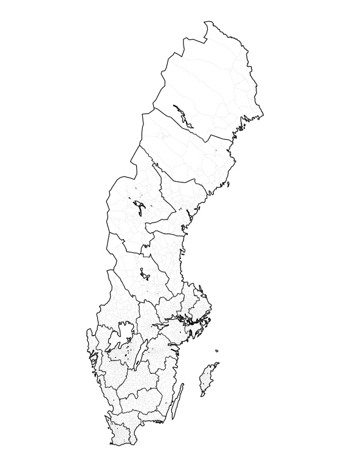

<!-- README.md is generated from README.Rmd. Please edit that file -->

# swehist

[](https://doi.org/10.5281/zenodo.23207967)

Boundaries of Swedish administrative units 1600-1990, as `sf` objects:
parishes, counties, municipalities, pastorships, deaneries, dioceses,
hundreds, magistrates courts, district courts, courts of appeal and
bailiwicks. Each unit is stored once per period in which its territory
was unchanged, with its predecessors and successors and the units it
belonged to. The package gives maps for any year or period, and matches
parish and unit names and codes in historical records to the maps.

The boundaries come from the historical GIS data of Riksarkivet (the
Swedish National Archives).

## Installation

``` r
install.packages("swehist",
                 repos = c("https://junkka.r-universe.dev", "https://cloud.r-project.org"))
# or from GitHub
# remotes::install_github("junkka/swehist")
```

## Example

``` r
library(swehist)
library(ggplot2)

parishes <- get_boundaries(1900, "parish")
counties <- get_borders(1900, "county")

ggplot() +
  geom_sf(data = parishes, fill = "white", colour = "grey75", linewidth = 0.05) +
  geom_sf(data = counties, colour = "black", linewidth = 0.4) +
  theme_void()
```

<!-- -->

Records that name a parish or give its code are linked to the map with
`match_units()`, and `assign_parent()` gives the county, pastorship,
court or other unit a parish belonged to in a given year:

``` r
m <- match_units(c("Lövånger", "Burträsk", "Nysätra"), county = "AC", date = 1880)
m[, c("input", "geom_id", "geom_name", "start", "end")]
#> # A tibble: 3 × 5
#>   input    geom_id geom_name                   start   end
#>   <chr>      <int> <chr>                       <int> <int>
#> 1 Lövånger    7478 Lövångers församling         1600  1990
#> 2 Burträsk    8046 Burträsks församling         1606  1918
#> 3 Nysätra     8082 Nysätra församling (AC-län)  1624  1990

assign_parent(m$geom_id, 1880, "pastorship")
#> # A tibble: 3 × 6
#>   geom_id parent_geom_id parent_name        parent_ref_code multiple grade  
#>     <int>          <int> <chr>              <chr>           <lgl>    <chr>  
#> 1    7478           9351 Lövångers pastorat SE/110303500    FALSE    sourced
#> 2    8046          10076 Burträsks pastorat SE/110304500    FALSE    sourced
#> 3    8082          10389 Nysätra pastorat   SE/110302500    FALSE    sourced
```

`vignette("usage", package = "swehist")` shows the main tasks: maps for
a year or a period, linking records, parent and child units, unit
histories.

## Datasets

| Dataset           |    Rows | Contents                                                               |
|-------------------|--------:|------------------------------------------------------------------------|
| `boundaries`      |  13,035 | Units of 11 types, one row per unit and period (sf)                    |
| `relations`       |  10,728 | Successors between units, and transfers of territory                   |
| `hierarchy`       | 174,909 | Which unit belonged to which, by year, with the evidence behind it     |
| `events`          |  33,921 | Creations, abolitions, renamings, mergers, splits and transfers        |
| `parish_link`     |   3,080 | Parish codes and names (Riksarkivet, SCB, Skatteverket)                |
| `parish_registry` |   3,467 | All parishes in Skatteverket’s register, incl. those without territory |
| `parish_meta`     |   3,080 | Parish codes and county                                                |
| `parish_codes`    |  10,823 | Every dated code (DDB, SCB, NAD) of every parish version               |
| `unit_variants`   |  46,293 | Name variants used by `match_units()`                                  |
| `quality_table`   |      66 | Coverage and evidence grade, by type and 50-year period                |
| `known_issues`    |      67 | Researched deviations that no source lets us correct                   |
| `hist_town`       |      31 | County towns (sf)                                                      |
| `sweden`          |       1 | National outline: the union of all parishes (sf)                       |

All spatial data are in SWEREF99 TM (EPSG:3006).

## Administrative types

| Type              | Swedish             | `type_id`           | Units | Versions | Years     |
|-------------------|---------------------|---------------------|------:|---------:|-----------|
| Parish            | Socken, församling  | `parish`            | 2,706 |    3,080 | 1600-1990 |
| County            | Län                 | `county`            |    25 |       98 | 1686-1990 |
| Municipality      | Kommun              | `municipality`      | 2,920 |    3,580 | 1863-1990 |
| Pastorship        | Pastorat            | `pastorship`        | 1,732 |    3,114 | 1600-1990 |
| Deanery           | Kontrakt            | `contract`          |   260 |      555 | 1600-1990 |
| Diocese           | Stift               | `diocese`           |    15 |       93 | 1600-1990 |
| Hundred           | Härad, tingslag     | `hundred`           |   413 |      716 | 1600-1990 |
| Magistrates court | Domsaga, rådhusrätt | `magistrates_court` |   377 |      636 | 1600-1970 |
| District court    | Tingsrätt           | `district_court`    |   110 |      143 | 1971-1990 |
| Court of appeal   | Hovrätt             | `court_of_appeal`   |     6 |       50 | 1683-1990 |
| Bailiwick         | Fögderi             | `bailiwick`         |   408 |      970 | 1600-1990 |

A *unit* is the thing itself; a *version* is one period in which its
territory did not change. Regiments have no boundaries; `hierarchy`
links them to their parishes.

## Sources

- **Riksarkivet** (Swedish National Archives): *Historiska GIS-kartor
  (information om territoriella indelningar i Sverige från 1500-talets
  slut till 1900-talets slut)* and the topographic register of the
  Nationell Arkivdatabas (NAD), released under CC0.
- **Skatteverket**: *Sveriges församlingar genom tiderna* (1989), for
  parish identifiers, names and the parish histories used to date
  pastorship and county links.
- **Statistics Sweden (SCB)**: parish codes.
- **The Demographic Data Base (DDB)**, Umeå University: parish names.

`data-raw/` has the build pipeline. It needs the Riksarkivet source
files, which are not in this repository (see `data-raw/README.md`).
`VALIDATION.md` summarises the checks of the data against independent
sources.

## Citation

`citation("swehist")` gives the reference:

Junkka, J. (2026). swehist: Swedish Historical Administrative
Boundaries. R package version 1.1.1.
<https://doi.org/10.5281/zenodo.23207968>

Cite the version you used. The DOI
[10.5281/zenodo.23207967](https://doi.org/10.5281/zenodo.23207967)
always resolves to the latest version.

## History

swehist grew out of my histmaps package (2015-2019,
<https://github.com/junkka/histmaps>), which I rebuilt as swehist in
2026 with AI agents (Claude) doing much of the work.

**How the data were made.** I designed the data model, set the rules for
which sources count as evidence and in what order, and decided the cases
where the sources disagree. Within that design I used AI agents to write
the build code and to research the 1,310 correction rows that decide
identity, membership and dates, each row carrying the printed or online
source it rests on (`data-raw/model/corrections*.csv`). The *Sveriges
statskalender* tables for the courts and the deaneries were parsed from
scanned text by scripts the agents wrote, and a large language model
read the parish histories in *Sveriges församlingar genom tiderna* into
dated tables (`data-raw/sfgt/` holds the prompts and the output). The
Skåne coordinate correction was fitted, and the missing exclaves found,
the same way. The sources are cited row by row and can be checked, and
the build is reproducible from them.

To measure accuracy, agents researched two held-out samples from printed
sources, without sight of the database. I checked about 100 of these
facts by hand, chosen by browsing the samples rather than by a fixed
rule and including many of the facts where the database and the source
disagree. For each I confirmed that the cited source, at the recorded
place, gives the recorded unit and that the unit is historically right,
and for each disagreement also that the database, not the fact, is
wrong. I found a few minor faults and no reason to doubt the facts as a
whole. However, since the sample was not drawn at random, it supports
the facts without giving an error rate for them.

I have not checked the correction rows one by one. Treat a citation as
the warrant for a value, and check it yourself where a result matters to
your work.

## License

The code is licensed MIT and the data CC BY 4.0; see `LICENSE.md`.
